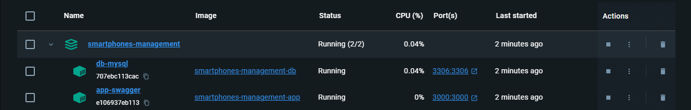
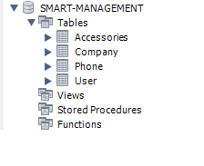
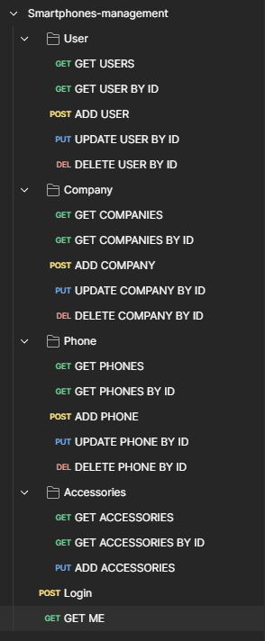

# Avaliação Contínua, Momento 1 - 2023/24

O presente repositório serve para mostrar o projeto designado M1, desenvolvido para a disciplina de Desenvolvimento WEB 2 do 2º ano da Licenciatura de Informática lecionada na Universidade da Maia.

O presente trabalho foi desenvolvido pelo grupo G23 constituído pelos seguintes elementos:

* [André Gomes](https://github.com/aasfgomes)
* [Gonçalo Sousa](https://github.com/MrcWithAMouth)

## Smart-Management

O objetivo do projeto é desenvolver uma aplicação para gerir smartphones utilizando Node.js e MySQL. Esta aplicação permitirá registar, atualizar e remover informações sobre smartphones, e também oferecer autenticação de utilizadores através de tokens JWT. A documentação da API será feita com o Swagger UI, proporcionando uma interface interativa para testar e compreender os endpoints da aplicação. A escolha destas tecnologias visa criar uma solução robusta e escalável para gerir informações de dispositivos móveis de forma eficiente e segura.

## Organização do repositório

* [Source code](https://github.com/INF23DW2G23/REPORT_DW2_M1)
* [Imagens](https://github.com/INF23DW2G23/REPORT_DW2_M1/tree/master/images)

## Galeria

### Docker

### DB

### Postman

### Tecnologias

* nodeJS
* MySQL
* Docker
* Postman

### Frameworks e Bibliotecas

* Express.js
* Swagger UI Express
* dotenv
* sequelize
* jsonwebtoken
* body-parser
* yamljs
* js-yaml

### Apresentação do projeto

* Capitulo 1: Descrição do projeto
* Capitulo 2: Recursos
* Capitulo 3: Desenvolvimento

### Dockerhub

[DockerHub](https://hub.docker.com/repositories/inf23dw2g23)
